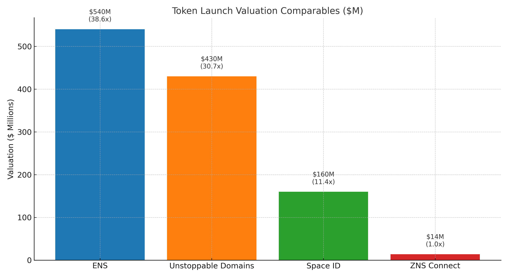

# 🏫 Equity Deal

ZNS Connect is opening up its first-ever equity round, offering strategic investors a unique opportunity to acquire ownership in a live, revenue-generating #Web3 identity platform — with direct exposure to both equity **and** token upside.

***

**📊 Deal Summary**

* **Pre-TGE Valuation:** $10M pre-TGE&#x20;
* **Equity Offered:** 20% (**$2M total raise**)
* **Structure:** 25%-50% blocks
* **Token Launch Potential:** $14M–$18M+
* **Revenue 2024-2025:** $770K+ [Dune data ](https://dune.com/zns/zns-connect)
* **Benchmark Comparables** [( read the full article)](https://znsconnect.medium.com/web3-domains-in-2025-why-zns-connect-is-the-real-challenger-to-ens-space-id-sns-ba2ae923cd8b) **:**
  * ENS – $730M
  * Space ID – $207M
  * Solana Name Sewrvice – $88M

***

<figure><figcaption>
Dune Results 
</figcaption></figure>

#### 🔐 **Token Warranty (Included)**

All equity investors receive:

* A **pro-rata allocation of ZNT tokens** (based on final supply model)
* Optional token vesting aligned with equity terms
* Token rights secured under a **warranty clause**, including investor protections
* Right to participate in token launch and CEX preparation phase

_Note: We are open to working with lead investors to refine tokenomics and final cap table design._

***

#### ⚖️ Legal Structure

* **Incorporation:** Panama
* **Equity Vehicle:** Common Shares or SAFE
* **Token Treatment:** Warrant-backed allocation with vesting
* **Documents:** SAFE draft available upon request

***

#### 📦 What You Get as an Investor

* 🏛 **Equity Ownership** in ZNS Connect
* 🪙 **Pro-rata Token Allocation** of $ZNT with vesting and warranty protections
* 🔗 **Ownership of** [**Creator Network** ](https://creatorchain.io/)– our live ZNS-powered blockchain
* 🔧 **Full Access to Platform** – including SDKs, domain auctions, and admin rights
* 🧩 **Revenue Participation** – from domain mints, SDKs, mobile, and smart card sales
* 🗳 **Governance Role** – help shape tokenomics, partnerships, product direction
* 🏆 **Early Investor Advantage** – join before token launch and major CEX integrations

***

#### Token Launch Potential

ZNS Connect is positioned for a **$14M–$18M token launch**, backed by real usage, protocol revenue, and market-ready infrastructure. With the right strategic partners, this launch could mirror — or outperform — top projects in the space.

**📊 Benchmark Comparables**

| Project                                                                   | Valuation     | Notable Backers / Exchanges           |
| ------------------------------------------------------------------------- | ------------- | ------------------------------------- |
| [**ENS**](https://dropstab.com/coins/ethereum-name-service/fundraising)   | $730M         | Coinbase, A16Z, major DAOs            |
| [**Space ID**](https://dropstab.com/coins/space-id)                       | $207M         | Polychain Capital, YZI Labs, DAO5     |
| [**Solana Name Service**](https://dropstab.com/coins/bonfida/fundraising) | $88M          | Spartan Group, Ryze Labs, FBG Capital |
| ZNS Connect                                                               | **$14M–$18M** | Self Funded                           |

***

📈 **ZNS Connect** — live, multi-chain, and community-driven — is next in line.

<figure><figcaption>
Token launch Valuation Competitors
</figcaption></figure>

***
