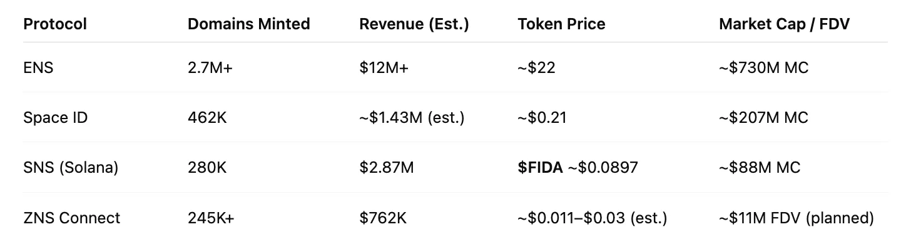
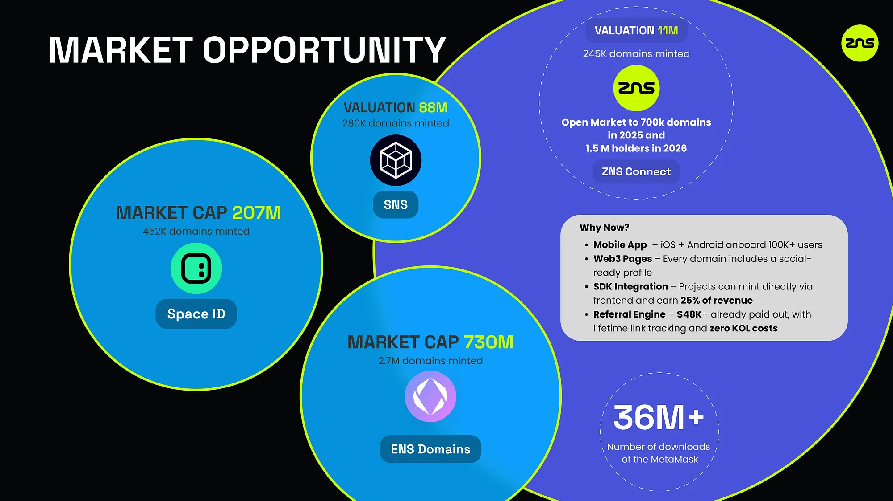
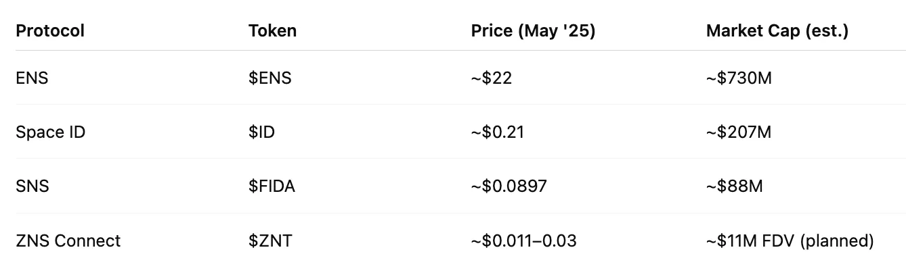

# Market Comparables

### &#x20;Why ZNS Connect Is the Real Challenger in Web3 Domains

As Web3 identity becomes a pillar of user experience, domain protocols like ENS, Space ID, Solana Name Service (SNS), and rising underdog ZNS Connect are defining the future of digital names.

***

### 🔍 Top Protocol Metrics (May 2023–May 2025)

* **ZNS Connect**: $762K revenue, <$100K in total burn
* **Space ID**: $1.4M revenue and $207M market cap
* **ENS**: $12M revenue and $730M market cap&#x20;
* **Solana Name Service (SNS)**: $2.87M revenue and $88M market cap

<figure><figcaption>
ENS, SNS, ZNS and Space ID
</figcaption></figure>

_Note: Revenue for Space ID and ZNS is estimated based on equal average mint price of \~$3.10 per domain._

***

### 🌟 5 Key Benefits of ZNS Connect

1. **Omnichain Native**: Built for 25+ EVM chains from the ground up.
2. **Monetized Identity**: $49K+ paid in referral rewards already.
3. **Social + Utility**: Domain + social posts, likes, and smart profile pages.
4. **Bootstrapped Efficiency**: $760K revenue, <$100K in total burn.
5. **Early Entry Point**: Token launch at \~$10M FDV offers massive upside.

<figure><figcaption>
Market Comparables and ZNS Connect
</figcaption></figure>

***

### 📈 Token & Market Outlook

* **ENS Token**: Trades around $22, with a market cap of approximately $730M.
* **Space ID Token**: Trades at \~$0.21, with a market cap near $207M.
* **FIDA Token (SNS)**: Trades around $0.0897, with a market cap of approximately $88M.
* **ZNS Token (Planned)**: Projected FDV of \~$10-11M.

<figure><figcaption>
ENS, ID, and FIDA tokens
</figcaption></figure>

***

### 🔗 ZNS: The ENS of the Omnichain Era

With live integrations on INK, Unichain, Monad, Scroll, and more, ZNS is expanding where others aren’t even looking. This is a pre-token, revenue-generating Web3 infrastructure play — built for the next billion users across chains.

> **Equity round open now.**\
> **Token launch upcoming.**\
> **Be early to the future of identity.**

***

***
